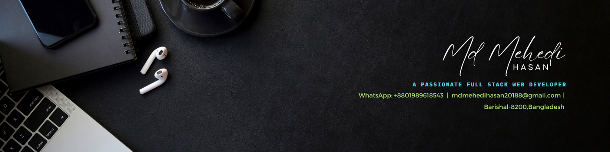

  

  

  

<h1 align="center">🥰 About Me  </h1>

-Hello Boss"!   
I'm Md Mehedi Hasan, a passionate front-end web developer with 3 years of experience. I have a strong foundation in HTML, CSS, and JavaScript,Python and I enjoy creating visually appealing and user-friendly websites.     

I have worked on various projects, collaborating with designers and back-end developers to bring concepts to life.    

My expertise lies in responsive design, ensuring that websites look great and function flawlessly across different devices and browsers.    

I am proficient in modern front-end frameworks like React js and I have experience with front-end build tools such as Webpack . I am constantly learning and staying up-to-date with the latest web technologies and best practices to deliver high-quality and efficient code.     

In addition to my technical skills, I also have a keen eye for design and user experience. I believe in creating intuitive interfaces that engage and delight users. I am a problem solver, and I enjoy finding creative solutions to challenges that arise during development.     

I am always excited to take on new projects and collaborate with like-minded individuals. If you have any questions or would like to discuss potential opportunities, feel free to reach out to me.    

Email : mdmehedihasan20188@gmail.com  
what'sapp : +8801989618543

You can reach me in 3 ways.     
Technology Lover | Positive Thinker | Motivator 

Self learning is my passion    
Thank You!

<h1 align="center">👨‍💼Experiences  </h1>

| No | Job Title | Job Tpye  | Company Name |  Start Date:| End Date | Location | 
| ------------- | ------------- | ---------- | ---------- | ---------- | ---------- |  ---------- |
| 3  | Software Engineering  | Intern  | Divine IT Ltd | OCT, 2022 | DEC,2022 | Uttara-Dhaka, Bangladesh |
| 2  | Assistant General Manager-IT | Remote  | Travel Til Dawn | July, 2021 | Aug, 2022 | South California, USA |
| 1  | Freelancer | Remote  | Fiverr,Upwork,PeopleperHour | Feb, 2019 | Present | World Wide |

<h1 align="center">🚂 Traning  </h1>

| No.   | Course Name and Learning Platform |
|-------|----------------------------------|
| 10    | MERN Stack Development   Programming HERO, YouTube, and Udemy |
| 9     | Cyber Security   Cyber 71 and E-Shikon |
| 8     | Web Development (PHP/Laravel)   Amar Bangaldesh Foundation and ICT DIVISION, Udemy |
| 7     | Web Design & Wordpress/WIX/Shopify   IT Bari, Bohubrihi, and Coders Foundation |
| 6     | Video Editing   MSB Academy, Shohag 360, and YouTube |
| 5     | SEO & Meta Ads   IT Bari and MD Faruk Khan |
| 4     | Graphic Design and Some UI/UX Design   Infra Polytechnic, Graphic Design Live Class BD, Instructory, Rayhan Sumon, and YouTube |
| 3     | Office Application   Infra Polytechnic Institute, Bright Skills, and YouTube |
| 2     | IT Support   Infra Polytechnic Institute |
| 1     | Digital Marketing   Bogura Outsourcing Institute and Tanvir Rasel |

<h1 align="center">🤹🏿‍♂️ Skillset  </h1>

Expertise: `Python` `HTML` `CSS` `Media Query` `Bootstrap` `TailwindCSS` `JavaScript` `ES6` `DOM` `BOM`  `React.js` `React Router DOM` `Material Ui` `Daisy Ui` `Express.js`  `MongoDB` `Django` `MYSQL` `OOP`

Familiar with Advanced: ` Javascript` `Python` `Java`  `Redux` `Node.js` `React Native` `Typescript` `CI/CD` `Pipeline` `POSTgreSQL` `GraphQL`  `Data Structures and Algorithms` 

Tools: `CLI` `VS code` `Git, GitHub` `BitBucket` `Netlify` `Vercel` `Browsers` `NPM` `Chrome Dev Tool` `Postman`  `Express Generator` `Web Mail` `Trello Board` `CSS Generator`

<h1 align="center">✨ EXTRA CO-CARRICULAM ACTIVITICS</h1>

- The Campus Team Leader of the ICT Olympiad Bangladesh.( Manage 30+ people )
- Content Creator
- Leadership
- Team Work
- Research Technology
- Motivator

<h1 align="center">🧶 EDUCATION</h1>

-  Diploma in Engineering,Computer Science & Technology,
     
     Infra Polytechnic Institute,Barishal

     Passing Year: 2022, Result:  3.91

<h1 align="center">🛬 LANGUAGES</h1>

-  Bengali - Native, Fluent Speaking, Listening, Reading and Writing
- English - Speaking, Listening, Reading and Writing
- Hindi - Conversational, Speaking, Listening and Understanding

 

<h1 align="center">⚙ Tech LANGUAGES</h1>

 
   &nbsp;
  &nbsp;
  &nbsp;
   &nbsp;
  &nbsp;
  &nbsp;
  &nbsp;
  &nbsp;
  &nbsp;
  &nbsp;
   &nbsp;
   &nbsp;
   &nbsp;
  &nbsp;
  &nbsp;
  &nbsp;
  &nbsp;
  

  

<h1 align="center">🔥 My GitHub Stats</h1>

  
  
  

 

 
  </a>

<h1 align="center">☎ Contact Me </h1>

  
  
  
  
   
  
  
    
  Email : mdmehedihasan20188@gmail.com  
  What'sapp : +8801989618543

